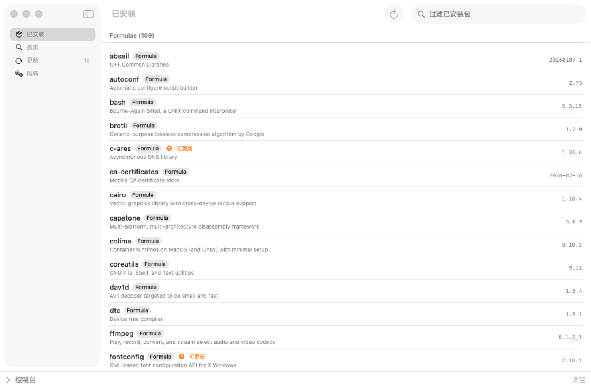

# Stein

A native macOS GUI for [Homebrew](https://brew.sh), built with SwiftUI.
**Stein**(英语"啤酒杯")— a beer mug for your brew. 🍺




## Features

- **Installed** — browse installed formulae & casks, with versions, descriptions, outdated badges, and a detail inspector
- **Search** — search formulae and casks as you type, one-click install
- **Updates** — see outdated packages at a glance, upgrade one or all, refresh brew metadata
- **Services** — manage `brew services` (start / stop / restart) with live status
- **Console** — streaming output of every mutating command in a bottom drawer

## Install

### Download

Grab `Stein.zip` from the [latest release](https://github.com/YoungKing1212/Stein/releases/latest),
unzip, and drag `Stein.app` to `/Applications`.

The app is not signed/notarized. On first launch either right-click → **Open**,
or remove the quarantine flag:

```bash
xattr -d com.apple.quarantine /Applications/Stein.app
```

### Build from source

Requirements: macOS 14+, Homebrew, and a Swift 6 toolchain
(Xcode Command Line Tools is enough — full Xcode not required).

```bash
git clone https://github.com/YoungKing1212/Stein.git
cd Stein
make run    # build & launch
make app    # produce .build/Stein.app (release, with icon)
make test   # run the SteinCore checks (zero-dependency test runner)
make icon   # regenerate the icon (tools/generate_icon.swift)
```

## Project Layout

```
Sources/
├── Stein/             # SwiftUI app: entry point, AppState, ViewModels, Views
├── SteinCore/         # brew interaction layer: JSON models, Process wrapper, CommandCenter
└── SteinCoreChecks/   # zero-dependency test runner (CLT has no XCTest/swift-testing)
tools/generate_icon.swift   # programmatic icon renderer (CoreGraphics)
Resources/                  # AppIcon.icns, Info.plist
```

## Notes

- All read-only queries use `brew --json=v2` output decoded with `Codable`.
- All mutating commands stream stdout/stderr live into the console.
- Uninstalls are always confirmed before running.

## Contributing

Issues and PRs are welcome — see the issue templates for bug reports and feature requests.

## License

[MIT](LICENSE) © 2026 YoungKing1212
